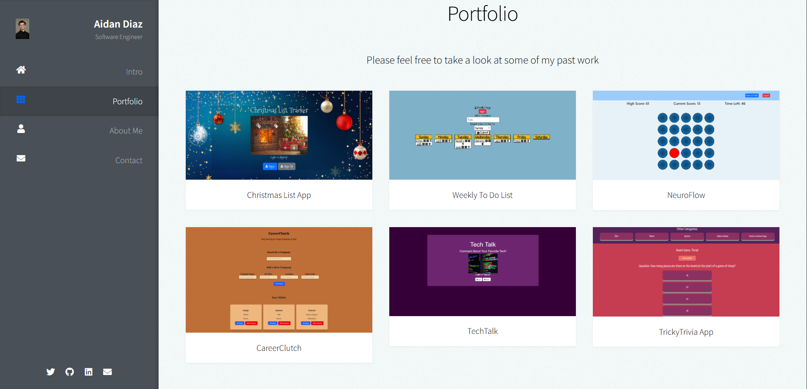

# My Portfolio

Link to site: https://aidandiaz.netlify.app/

## Tech used: 
- HTML5
- CSS3
- SASS
- JavaScript

My learning was focused on effectively plugging in all of my information to the already provided template.

## Optimizations

I updated the containing elements to have no set height property, to ensure that they would always contain all of their content.

## Lessons Learned:

I learned that Netlify has a built in form submission option that allows forms to be sent directly to my email - which I have utilized for a convenient way of receiving messages. 
